# F5 SSL Orchestrator + Palo Alto Networks NGFW Integration

Reference architecture and implementation guide for integrating **F5 SSL Orchestrator (SSLO)** with **Palo Alto Networks Next-Generation Firewalls (NGFWs)**.

> **Scope:** This repository is an architecture/reference implementation, not a vendor-supported automation package. Interface names, VLAN IDs, IP addressing, PAN-OS objects, and SSLO configuration values are intentionally placeholders and must be adapted to the target environment.

## What this repository covers

The supplied F5/Palo Alto solution material describes a common integration pattern where F5 SSLO establishes independent TLS sessions with the client and web server, decrypts traffic, sends clear-text traffic through a Palo Alto security service, then re-encrypts it toward the destination. The material also describes health monitoring, dynamic service chaining, load balancing across security services, and several deployment modes.

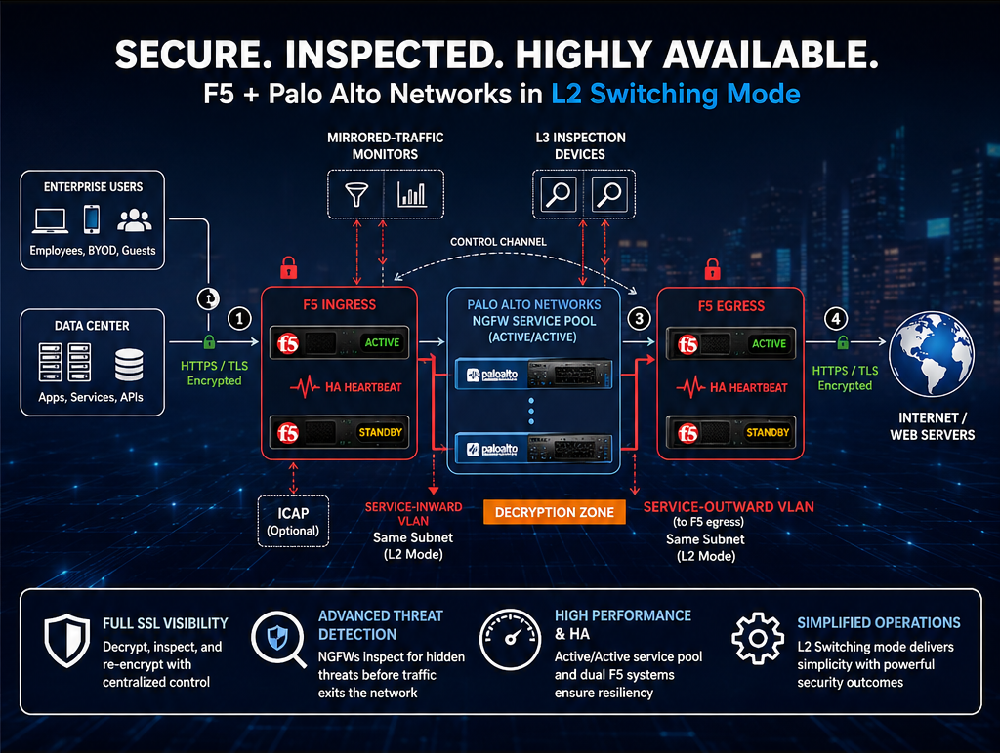

### Design options

| Option | Palo Alto mode | F5 service type | Primary use case |
|---|---|---|---|
| 01 | L2 / Virtual Wire | L2 Inline | Transparent inline inspection |
| 02 | L2 Switching | L2 Inline | PAN-OS provides switching between networks |
| 03 | L3 Routed | L3 Inline | Routed service insertion / separate subnets |
| 04 | TAP / Clone | Receive-only / TAP | Out-of-band visibility / IPS or WildFire analysis |
| 05 | Two F5 HA systems + firewall service pool | L2/V-Wire or L3 | Separate ingress decryption and egress re-encryption |
| 06 | Two F5 systems with firewalls in the decryption zone | L2/V-Wire or L3 | Dedicated decryption-zone architecture |

## Architecture principle

```text
Client
  |
  v
+--------------------+
| F5 SSLO - Ingress  |
| TLS decrypt        |
| Service chaining   |
+---------+----------+
          |
          v
+--------------------+
| Palo Alto NGFW     |
| IPS / App-ID /     |
| Content / Threat   |
+---------+----------+
          |
          v
+--------------------+
| F5 SSLO            |
| Re-encrypt         |
+---------+----------+
          |
          v
       Internet
```

The source presentation states that F5 intercepts HTTPS, decrypts the client-encrypted traffic, steers the decrypted traffic to a pool of Palo Alto firewalls for inspection, then re-encrypts toward the web server; return traffic follows the corresponding reverse path. 

## Repository structure

```text
.
├── README.md
├── LICENSE
├── .gitignore
├── pictures/
├── diagrams/
│   └── end-to-end-architecture.mmd

```

## Recommended implementation sequence

1. Decide whether the Palo Alto service should be inline or receive-only.
2. Decide whether the service is L2/V-Wire, L2 switching, or L3 routed.
3. Define the SSLO ingress/egress topology.
4. Define service VLANs/subnets and HA behavior.
5. Build the Palo Alto service object(s).
6. Configure the SSLO service and service pool.
7. Build the SSLO service chain.
8. Apply SSL interception/decryption policy.
9. Validate forward and reverse traffic.
10. Test failure of each Palo Alto member and confirm SSLO health monitoring/failover behavior.

## Important design notes
## Deployment Modes

### 1) L2 / Virtual Wire

This deployment mode entails a single F5 system performing SSL visibility. This single system handles both decryption and re-encryption of HTTPS traffic, with an inspection zone installed between the ingress and the egress. Figure 12 shows a standalone F5 system configured to intercept, decrypt, and steer the decrypted traffic to a service pool of two Palo Alto Networks firewalls configured in L2 mode or in V-wire mode where the traffic will be inspected for hidden threats. You can also deploy the F5 system as a device sync/failover device group (including an HA pair) with a floating IP address for high availability.

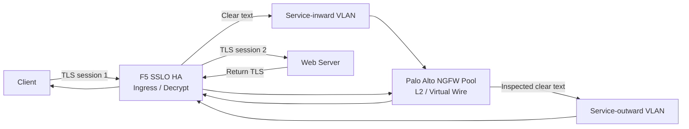

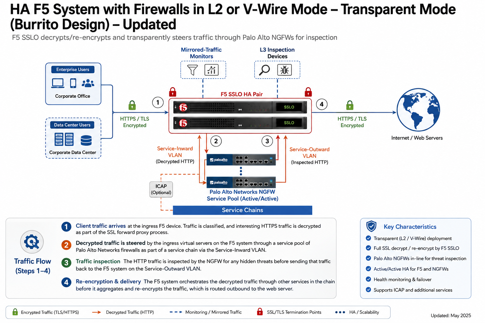

The supplied material describes the L2/V-Wire option as a transparent deployment where the Palo Alto firewalls are placed in the inspection path. The Palo Alto documentation likewise describes virtual wire as a transparent connection between two firewall interfaces without switching or routing on those interfaces.

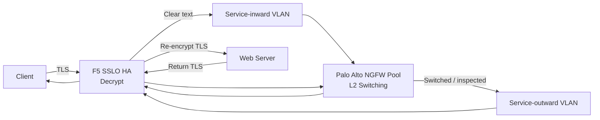
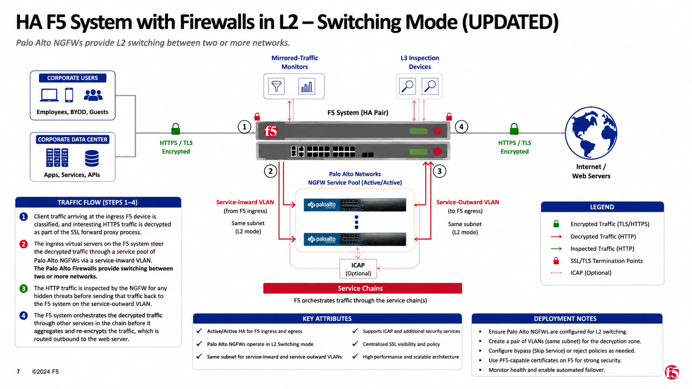

### 2) L3 Routed

This deployment is similar to the solution explained above in the section called, “Configuration for a F5 BIG-IP system with a firewall in L2 or V-Wire mode.” The only difference is that the inline service type is configured as an L3 service.

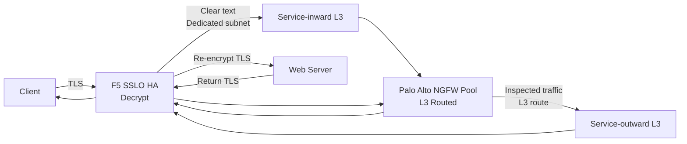
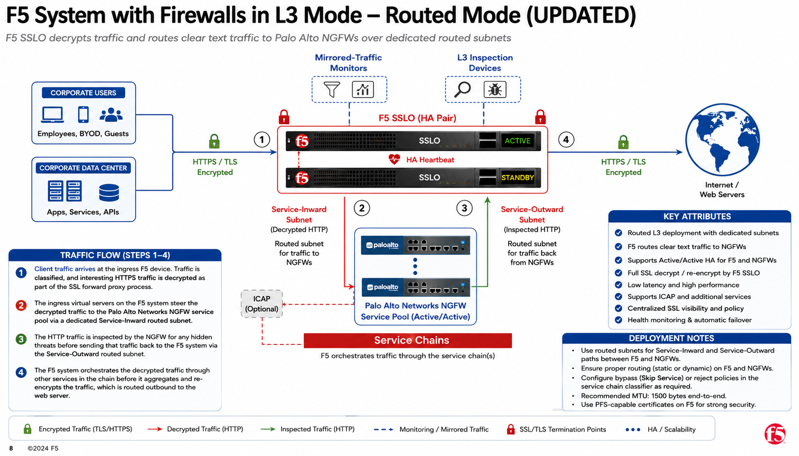

The supplied material describes the L3 option as an inline service using a dedicated subnet on the service-inward side and routed traffic returning on the service-outward side. It also notes that the Palo Alto devices can be more than one hop away, while recommending no more than two hops.

### 3) TAP / Clone

In this solution option, the F5 system is configured to provide a packet-by-packet copy of both the unencrypted HTTP and decrypted HTTPS traffic to Palo Alto Networks NGFW devices wherein the IPS/WildFire is configured for TAP mode.

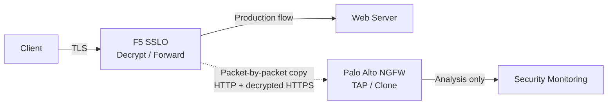
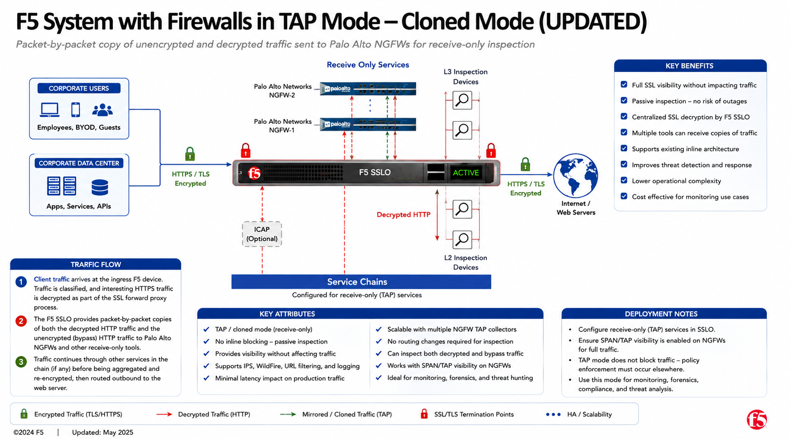

The supplied material describes TAP/clone as a packet-by-packet copy of unencrypted HTTP and decrypted HTTPS traffic sent to Palo Alto NGFWs operating in TAP mode. This is a visibility architecture rather than the inline blocking path.

## Alternative Architectures – Advanced Deployment Modes
As previously explained in the Deployment Modes section, you may want to deploy a second F5 device for various reasons. This section briefly addresses these alternative architecture and the additional configuration steps needed 
for deployment. The advanced architectures separate ingress decryption from egress re-encryption. This can be useful when the architecture needs to distribute processing or create a dedicated decryption zone.

### 1) Dual F5 HA systems with firewalls deployed as a service pool

This solution is similar to the one explained in the section called, Configuring the F5 System with Palo Alto Networks Firewalls in L2 or V-Wire Mode. The only difference is that a second F5 device (the egress device) is introduced to 
offload re-encryption from the ingress device


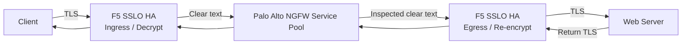
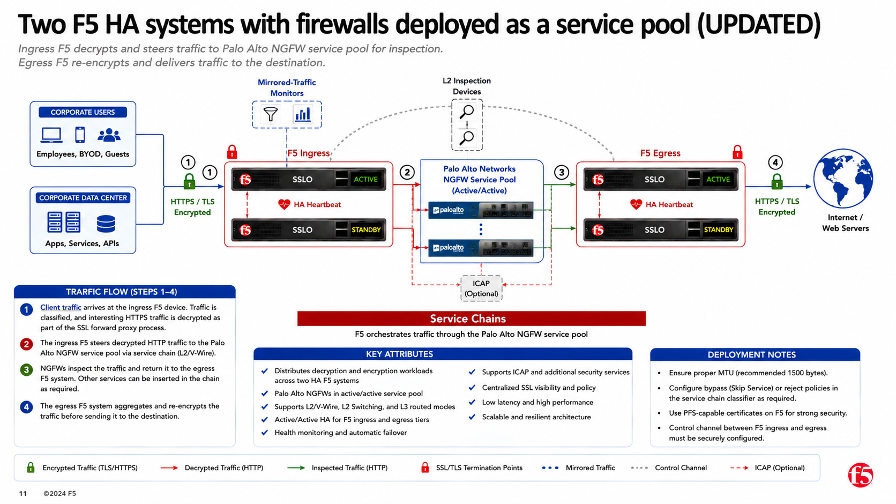

### 2) Two F5 systems with firewalls sandwiched in the decryption zone
In this case, the Palo Alto Networks firewalls are deployed as a load balancing pool between the ingress and egress F5 systems in the decrypt zone and are not part of the service chains. 


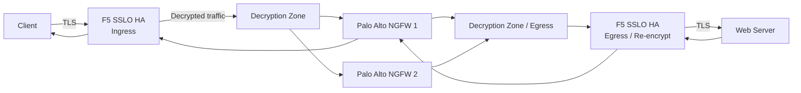
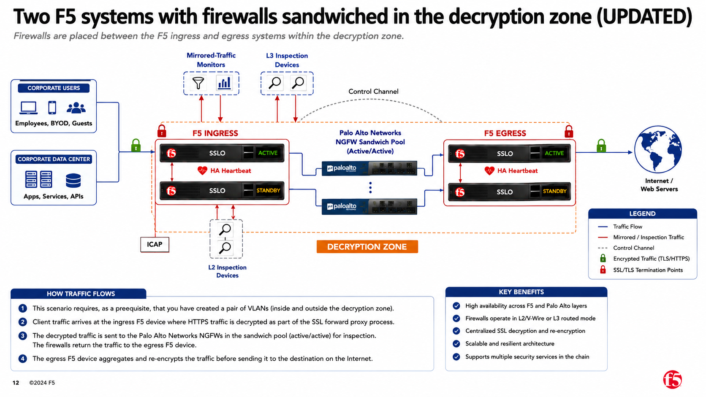

## Validation matrix

| Test | Expected result |
|---|---|
| HTTPS request | TLS is decrypted by SSLO and inspected by PAN NGFW |
| HTTPS response | Return traffic is decrypted/inspected and re-encrypted toward client |
| HTTP request | Policy determines whether it enters the service chain |
| Non-interesting traffic | Bypasses or follows policy as designed |
| PAN member failure | SSLO removes failed service from pool |
| PAN member recovery | Service returns to pool after health validation |
| TLS 1.2 | Visible to inspection service |
| PFS-enabled cipher | Visibility maintained where supported/configured |
| TAP design | Traffic is copied; production forwarding path remains independent |
| Dual-F5 design | Ingress and egress processing remain operational independently |


## Source material

The architecture in this repository is based primarily on the documentation available  **“F5 SSL Orchestrator and Palo Alto Networks Next-Gen Firewall Solution”** 

The supplied documentation explicitly documents the L2/V-Wire, L2 switching, L3 routed, TAP/clone, dual-F5 service-pool, and dual-F5 decryption-zone options. 


# Customer Architecture Toolkit

## Design selection decision tree

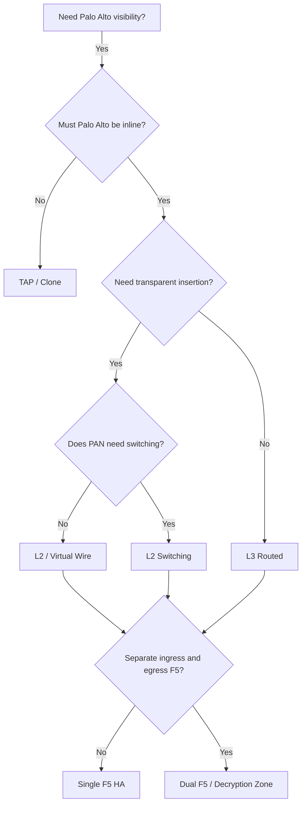

## Design comparison

| Capability | L2/V-Wire | L2 Switching | L3 Routed | TAP/Clone | Dual F5 |
|---|---:|---:|---:|---:|---:|
| Inline enforcement | Yes | Yes | Yes | No | Yes |
| Transparent insertion | Yes | Yes-ish | No | N/A | Depends |
| PAN provides routing | No | No | Yes | No | Depends |
| PAN provides switching | No | Yes | No | No | Depends |
| Out-of-band visibility | No | No | No | Yes | No |
| Separate decrypt/re-encrypt F5 roles | No | No | No | No | Yes |
| Dedicated service subnets | Usually no | Usually no | Yes | N/A | Depends |
| Best fit | Simple transparent insertion | L2 segmentation | Routed service insertion | Visibility | Scale / separation |

> The matrix is an architectural summary of the supplied designs, not a statement of product support beyond the cited documentation.

## Customer discovery questions

Before selecting a design, collect:

1. Is traffic outbound, inbound, or both?
2. Is SSLO deployed as a single device or HA pair?
3. Does the PAN firewall need to be inline and enforcement-capable?
4. Does the PAN firewall need to route?
5. Does the PAN firewall need to switch Layer-2 networks?
6. Is a transparent bump-in-the-wire architecture required?
7. Are dedicated service VLANs/subnets available?
8. How many PAN firewalls are required in the service pool?
9. What is the expected peak decrypted throughput?
10. What failure behavior is required if every PAN service becomes unavailable?
11. Are there TLS certificate-pinning exceptions?
12. Are there applications that must bypass decryption?
13. Is a separate decryption zone required?
14. Does the design require separate F5 ingress and egress processing?
15. What telemetry must be retained on F5 and Palo Alto?

## Configuration model


## Operational success criteria

A deployment should not be considered complete until all of the following are demonstrated:

- TLS interception works for an approved test destination.
- Palo Alto receives the decrypted flow.
- Palo Alto security policy is applied to the expected traffic.
- Return traffic reaches SSLO.
- SSLO re-encrypts the response.
- A denied/threat test demonstrates enforcement where inline mode is used.
- A Palo Alto member failure causes the service pool to remove the failed member.
- Service recovery causes the member to return to service after health validation.
- SSLO HA failover is tested.
- Bypass rules are validated.
- Packet captures prove the intended flow at each service boundary.

## Current documentation references

- F5 SSLO topology documentation: https://techdocs.f5.com/en-us/bigip-21-1-0/ssl-orchestrator-setup/topologies-in-sslo/configuring_topology.html
- F5 SSLO service-chain documentation: https://techdocs.f5.com/en-us/bigip-21-0-0/ssl-orchestrator-setup/topologies-in-sslo/configuring-service-chain.html
- Palo Alto Virtual Wire documentation: https://docs.paloaltonetworks.com/ngfw/networking/configure-interfaces/virtual-wire-interfaces
- Palo Alto Layer 2 interface documentation: https://docs.paloaltonetworks.com/ngfw/networking/configure-interfaces/layer-2-interfaces
- F5 ssl orchestrator manual: https://techdocs.f5.com/kb/en-us/products/ssl-orchestrator/manuals/product/f5-herculon-ssl-orchestrator-setup-13-1-0-iapp-3-0/1.html
- F5 ssl orchestrator and cisco wsa solution for ssl visibility: https://community.f5.com/kb/technicalarticles/f5-ssl-orchestrator-and-cisco-wsa-solution-for-ssl-visibility-and-management/287314
- F5-BIG-IP-Platform-Palo-Alto-Networks-Next-Gen-Firewall-Solution: https://www.scribd.com/document/1054816522/F5-BIG-IP-Platform-Palo-Alto-Networks-Next-Gen-Firewall-Solution


## Final Architecture Edition

Adds detailed deployment planning, sizing, horizontal scaling, SSL exemptions, certificate/PFS guidance, configuration runbooks, service-chain classifier design, multiple Palo Alto pools, NAT/edge architectures, failure testing and packet-capture validation. The supplied guide identifies centralized decryption/re-encryption, dynamic service chaining, load balancing and health monitoring as core capabilities.
